# **_Rock Paper Scissors Lizard Spock Game_**

RPSLS is a game where you choose one of the following, Rock, Paper, Scissor, Lizar or Spock and the computer randomly chooses one as well. Then if you won you get a score added or if the computer won it gets a score added. The game score goes to 5 and which one reaches it before wins the game.

Welcome to the journey through <a href="https://github.com/johannes2503/Project-2-RPSLS" target="_blank" rel="noopener">Rock Paper Scissors Lizar Spock</a>

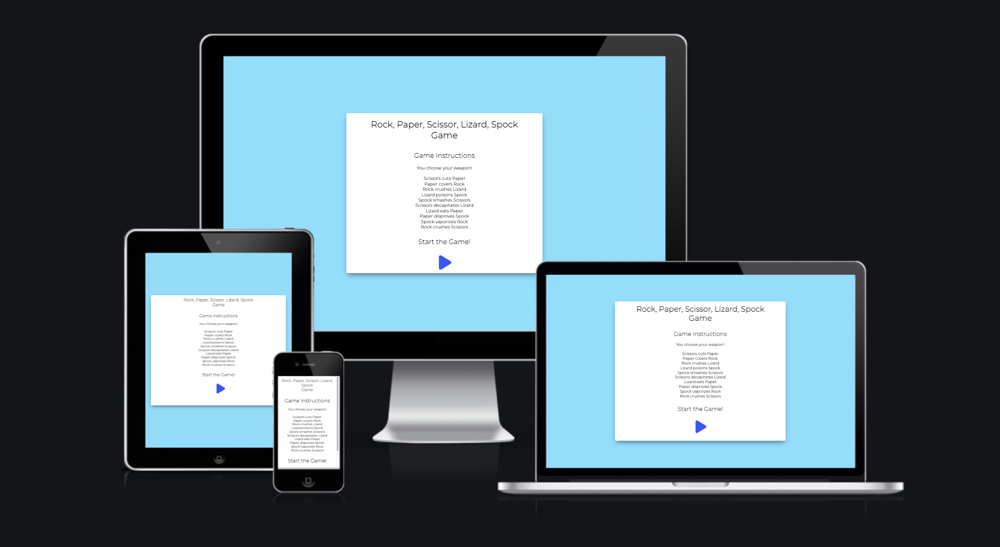

# Contents

* [**User Experience UX**](<#user-experience-ux>)
    * [Wireframes](<#wireframes>)
    * [Site Structure](<#site-structure>)
    * [Design Choices](<#design-choices>)
    *  [Typography](<#typography>)
    *  [Colour Scheme](<#colour-scheme>)
* [**Features**](<#features>)
    * [**Home**](<#navigation-menu>)
         * [Navigation menu](<#navigation-menu>)
         * [Owners Welcome](<#owners-welcome>)
         * [Footer](<#footer>)
         * [Menu page](<#menu-page>)
         * [Reservations page](<#reservations-page>)
         * [Contact us page](<#contact-us-page>)
    * [**Future Features**](<#future-features>)
* [**Technologies Used**](<#technologies-used>)
* [**Testing**](<#testing>)
* [**Deployment**](<#deployment>)
* [**Credits**](<#credits>)
    * [**Content**](<#content>)
    * [**Media**](<#media>)
*  [**Acknowledgements**](<#acknowledgements>)

# User Experience (UX)

## Wireframes

The wireframes for Restaurant were produced in [Figma](https://figma.com). There are frames for a full width display. The final site varies slightly from the wireframes due to developments that occured during the creation process. 

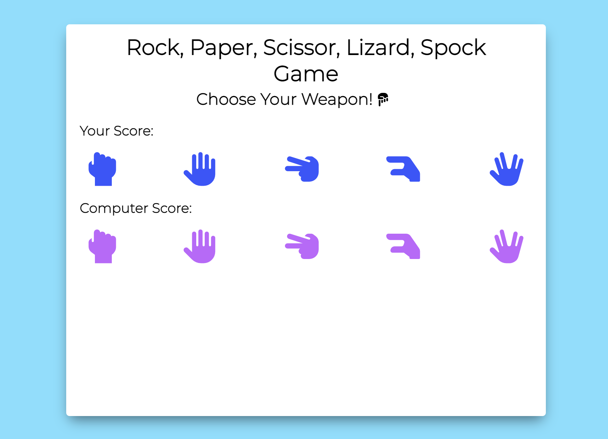

[Back to top](<#contents>)

## Site Structure

RPSLS game has two pages. The [home page](./index.html) is the default loading page and the [Game page](./game.html)

[Back to top](<#contents>)

## Design Choices

 * ### Typography
      The fonts chosen were 'Montserrat' for all fonts in the game. They fall back to sans-serif respectively. 

 * ### Colour Scheme
      The colors are very bright and fun. They were chosen to brighten up the game and give some lightness to it.

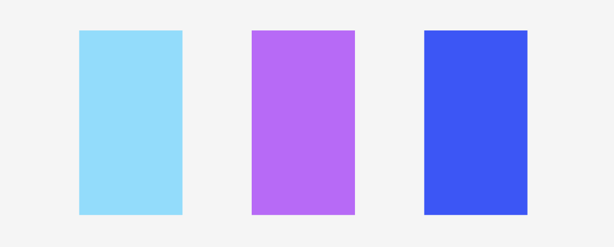

[Back to top](<#contents>)

# Features

RPSLS game is a game for fun. The landing page has the instructions and then you start the game and choose your weapon to combat the computer. 

## Existing Features 

  * ### Landing page

    * This is the landing page which you start on, it is fully responsive and contains link to the main game page.

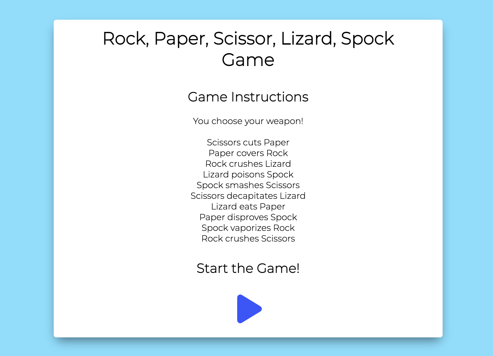

[Back to top](<#contents>)

  * ### Main game area

      * This is the main game area, where you choose your weapaon and play against the computer.
      

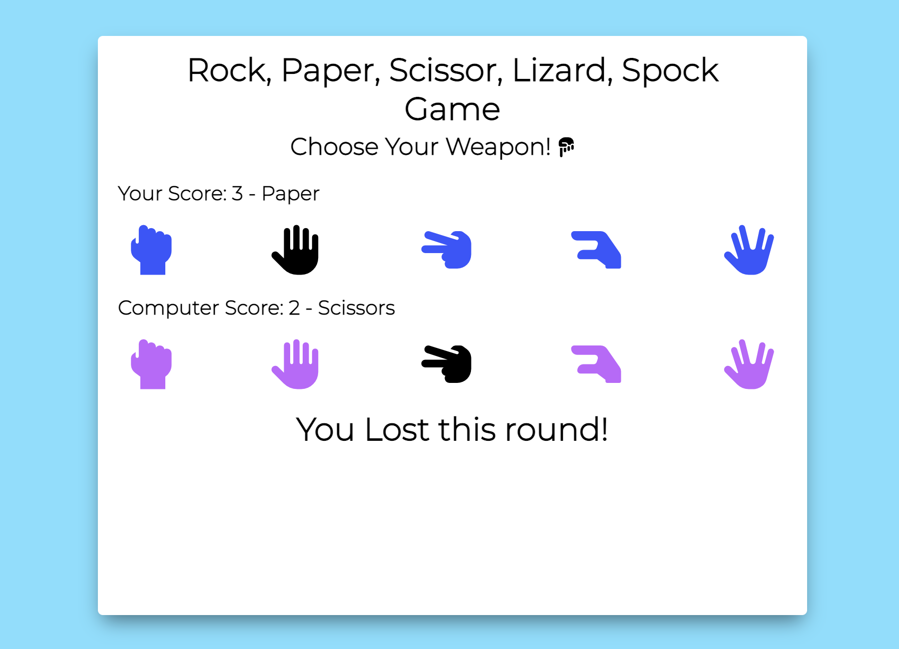

[Back to top](<#contents>)

 * ### Main game area - game in progress

      * Here you can see the game in progress, the layout of game choices and result text.
      

[Back to top](<#contents>)

 * ### Main game area - Won game

      * This is the screen that comes up if you win the game! Here you can see the result and also you can reset the game and try again.
      

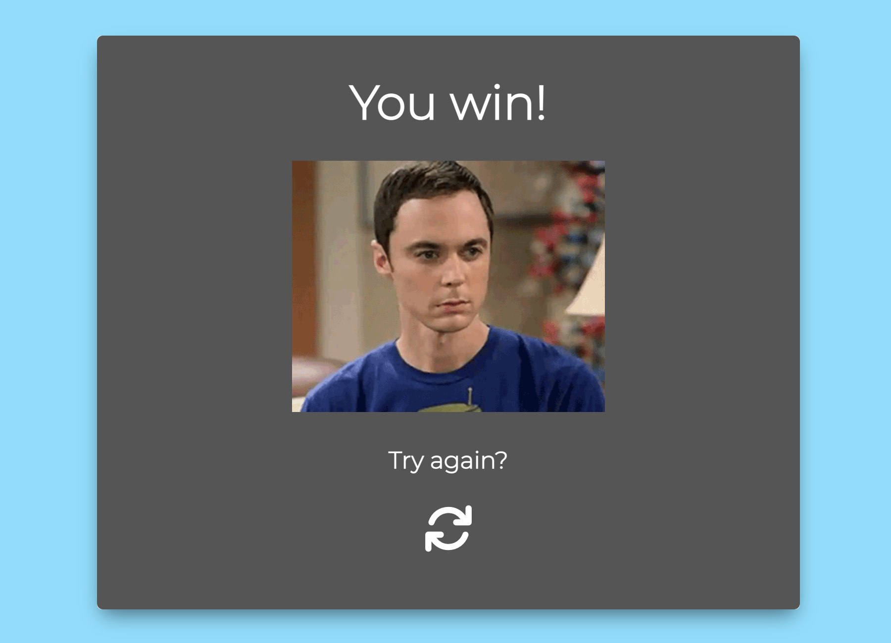

[Back to top](<#contents>)

* ### Main game area - Lost game

      * This is the screen that comes up if you lose the game! Here you can see the result and also you can reset the game and try again.
      

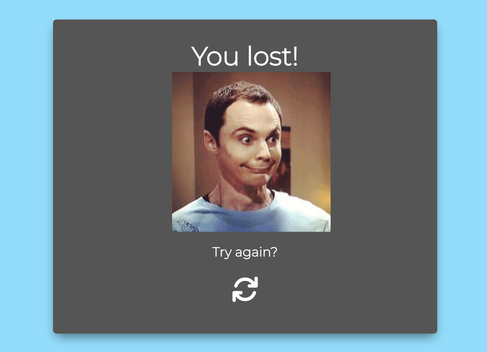

[Back to top](<#contents>)

# Technologies Used
* [HTML5](https://html.spec.whatwg.org/) - provides the content and structure for the website.
* [CSS](https://www.w3.org/Style/CSS/Overview.en.html) - provides the styling.
* [JavaScript](https://developer.mozilla.org/en-US/docs/Web/JavaScript) - provides the function of the game.
* [Figma](https://figma.com) - used to create the wireframes.
* [Gitpod](https://www.gitpod.io/#get-started) - used to deploy the website.
* [Github](https://github.com/) - used to host and edit the website.

[Back to top](<#contents>)

# Testing

## Code Validation
The RPSLS game site has be throughly tested. All the code has been run through the [W3C html Validator](https://validator.w3.org/) the [W3C CSS Validator](https://jigsaw.w3.org/css-validator/) and [JSHint javascript validator](https://jshint.com/). Errors were found. After a fix and retest, no errors were returned. 

The HTML validator results for each page are below:

* Home page

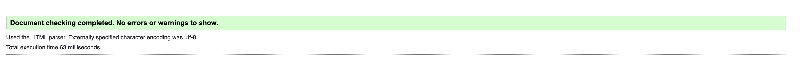

* Main game page

The CSS validator results are below:

## Responsiveness Test

* The responsive design tests were carried out manually with [Google Chrome DevTools](https://developer.chrome.com/docs/devtools/) and [Responsive Design Checker](https://www.responsivedesignchecker.com/).

|        | Moto G4 | Galaxy S5 | iPhone 5 | iPad | iPad Pro | Display <1200px | Display >1200px |
|--------|---------|-----------|----------|------|----------|-----------------|-----------------|
| Render | pass    | pass      | pass     | pass | pass     | pass            | pass            |
| Images | pass    | pass      | pass     | pass | pass     | pass            | pass            |
| Links  | pass    | pass      | pass     | pass | pass     | pass            | pass            |

Note: On wide display types the contents of the site are restricted in width to 2000px. This helps the UX by not spreading the content too wide on the extra wide screens.

## Browser Compatibility

RPSLS game was tested on the following browsers with no visible issues for the user. 
Google Chrome, Microsoft Edge, Safari and Mozilla Firefox. Appearance, functionality and responsiveness were consistent throughout for a range of device sizes and browsers.

## Known Bugs
* ### Resolved

    * During validation two bugs became known during the validation stage, a brief description is below:

    * CSS - 
    Wrong attribute for one of the text elements. Fixed.

* ### Unresolved
    * JavaScript warnings in the JShint validator.

[Back to top](<#contents>)

# Deployment

### **To deploy the project**
The site was deployed to GitHub pages. The steps to deploy a site are as follows:
  1. In the GitHub repository, navigate to the **Settings** tab.
  2. Once in Settings, navigate to the **Pages** tab on the left hand side.
  3. Under **Source**, select the branch to **main**, then click **save**.
  4. Once the master branch has been selected, the page will be automatically refreshed with a detailed ribbon display to indicate the successful deployment.

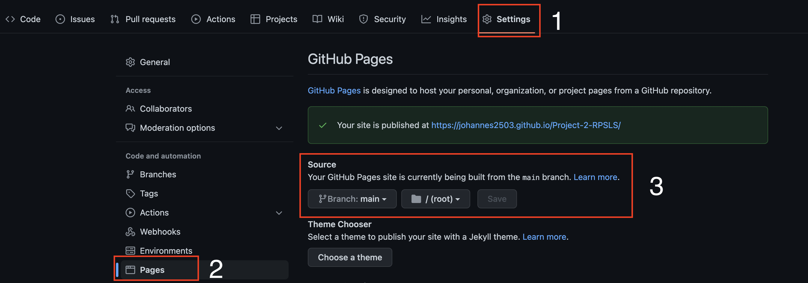

  The live link to the Github repository can be found here - https://johannes2503.github.io/Project-2-RPSLS/

### **To fork the repository on GitHub**
A copy of the GitHub Repository can be made by forking the GitHub account. This copy can be viewed and changes can be made to the copy without affecting the original repository. Take the following steps to fork the repository;
1. Log in to **GitHub** and locate the [repository](https://johannes2503.github.io/Project-2-RPSLS/).
2. On the right hand side of the page inline with the repository name is a button called **'Fork'**, click on the button to create a copy of the original repository in your GitHub Account.
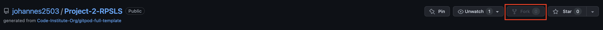

### **To create a local clone of this project**
The method from cloning a project from GitHub is below:

1. Under the repository’s name, click on the **code** tab.
2. In the **Clone with HTTPS** section, click on the clipboard icon to copy the given URL.
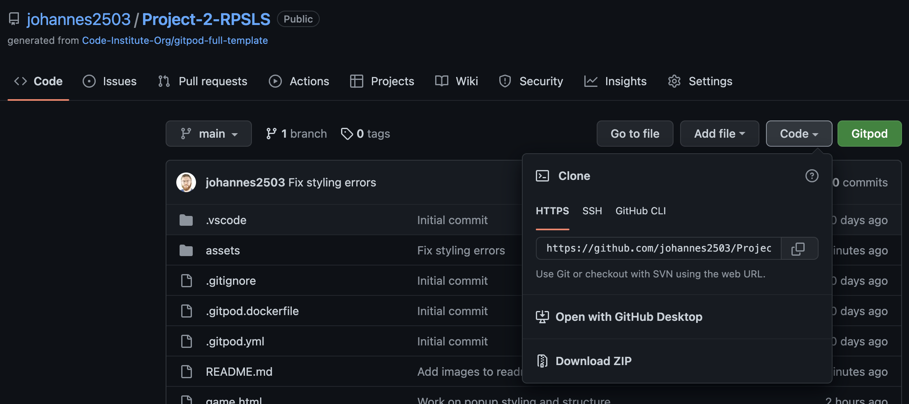
3. In your IDE of choice, open **Git Bash**.
4. Change the current working directory to the location where you want the cloned directory to be made.
5. Type **git clone**, and then paste the URL copied from GitHub.
6. Press **enter** and the local clone will be created.

[Back to top](<#contents>)

# Credits
### Content

* The font came from [Google Fonts](https://fonts.google.com/).
* The colour palate was found on [Behance](http://behance.net/).
* The icons came from [Font Awesome](https://fontawesome.com/).
* [Figma](https://figma.com) was used to create the wireframes.

[Back to top](<#contents>)

# Acknowledgements
The Game was completed as a Portfolio 2 Project piece for the Full Stack Software Developer (e-Commerce) Diploma at the [Code Institute](https://codeinstitute.net/). As such I would like to thank my mentor [Precious Ijege](https://www.linkedin.com/in/precious-ijege-908a00168/), the Slack community, and all at the Code Institute for their help and support. Also want to thank Ewan Colquhoun for the README.md template which this readme is based on.[Ewan Colquhoun](https://github.com/EwanColquhoun/wawaswoods/blob/master/README.md).

Johannes Hreinsson 2022.

[Back to top](<#contents>)